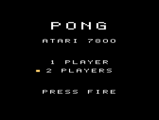
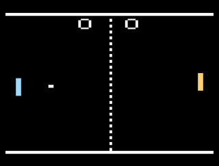
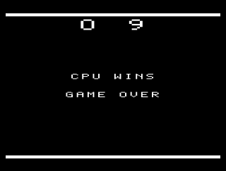

# PONG 7800

**아타리 7800**(1986)용 퐁입니다. 6502 어셈블리로 새로 작성한 실제 카트리지 ROM이라,
에뮬레이터는 물론 플래시 카트를 통해 실기에서도 그대로 돌아갑니다.





## 실행 방법

[`pong.a78`](pong.a78)을 내려받아 7800 에뮬레이터로 열면 됩니다.

| 에뮬레이터 | 비고 |
|---|---|
| [A7800](https://github.com/7800-devtools/a7800) | 7800 전용. 이 게임을 만들고 검증한 환경입니다 |
| [MAME](https://www.mamedev.org/) | `mame a7800 -cart pong.a78` |
| [ProSystem](https://gstanton.github.io/ProSystem1_3/) | 윈도우용, 가볍습니다 |
| [EMU7800](https://emu7800.github.io/) | 윈도우용 |
| RetroArch | ProSystem 코어 |

카트리지 헤더에 **32K 리니어 / NTSC / 양쪽 포트 조이스틱**이 명시돼 있어서 따로 설정할
것은 없습니다. 그냥 열면 바로 타이틀 화면이 뜹니다.

Concerto, Dragonfly 같은 플래시 카트에도 같은 `.a78` 파일을 그대로 넣으면 됩니다.

> **BIOS 없이 쓰세요.** A7800과 MAME은 콘솔 BIOS 파일(`7800.u7`)이 없으면 그냥 건너뛰고
> 카트리지를 바로 부팅합니다. 실행할 때 나오는 `OPTIONAL 7800.u7 NOT FOUND` 경고가 그
> 뜻이니 무시하면 됩니다.

## 조작

| 입력 | 동작 |
|---|---|
| 조이스틱 1 위/아래 | 왼쪽 패들. 타이틀에서는 모드 선택 |
| 조이스틱 2 위/아래 | 2인용일 때 오른쪽 패들 |
| 파이어 | 게임 시작 / 게임 오버 화면 넘기기 |
| SELECT 스위치 | 1인용 ↔ 2인용 전환 |
| RESET 스위치 | 언제든 타이틀 화면으로 |

7800 프로라인 패드와 2600 조이스틱 모두 인식합니다.

## 게임 규칙

- **9점 선취**하면 승리합니다.
- 랠리가 이어질수록 공이 빨라집니다. 프레임당 1.5픽셀에서 시작해 최대 3픽셀까지.
- 공이 튀는 각도는 **패들의 어느 지점에 맞았는지**로 결정됩니다. 가장자리에 맞히면 크게 꺾입니다.
- 1인용에서 오른쪽은 컴퓨터입니다. 프레임당 2픽셀로 움직이고(플레이어는 3픽셀), 공이
  자기 쪽으로 넘어와 중앙을 지난 뒤에야 따라가기 시작합니다. 그래서 이길 수 있습니다.

## 기술 메모

7800에는 **스프라이트도 타일맵도 없습니다.** 그래픽 칩 MARIA가 프레임마다
디스플레이 리스트를 훑으면서 8라인짜리 구역(zone)마다 그릴 오브젝트 목록을 읽어들이는
방식입니다. 이 게임은 화면을 24개 구역(24 × 8 = 192라인)으로 나누고, 매 프레임
수직 귀선 기간에 24개 구역의 디스플레이 리스트를 전부 새로 씁니다.

까다로운 부분은 MARIA가 그래픽 주소를 이렇게 계산한다는 점입니다:

```
주소 = 그래픽주소 + x + (offset << 8)
```

`offset`이 스캔라인마다 **감소**하고 그 값이 주소의 **상위 바이트**에 더해집니다. 그래서
스프라이트의 각 가로줄은 256바이트씩 떨어진 페이지에 저장해야 하고, 게다가 offset이
줄어드니 **맨 윗줄이 가장 높은 페이지**에 와야 합니다. 그래픽 데이터가 위아래로 뒤집힌
채 페이지마다 흩어져 있는 셈입니다.

구역 경계에서 잘리는 처리는 **홀리 DMA**(holey DMA)에 맡겼습니다. 이 기능을 켜면 MARIA가
홀수 2K 블록을 전부 0으로 읽기 때문에, 그래픽을 짝수 2K 블록에만 두면 스프라이트가
구역 밖으로 삐져나간 부분이 저절로 비어 보입니다. 덕분에 마스킹이나 시프트 없이
디스플레이 리스트 항목 최대 2개로 아무 픽셀 위치에나 오브젝트를 찍을 수 있습니다.

그 외:

- 32768바이트 리니어 카트리지, `$8000`–`$FFFF`에 매핑
- 160×192 해상도, 160A 모드(1바이트 = 4픽셀, 픽셀당 2비트)
- 효과음은 TIA 2채널 — 패들, 벽, 득점
- 디스플레이 리스트 갱신은 전부 수직 귀선 + 상단 오버스캔 구간(약 44라인) 안에서
  끝나고, 게임 로직은 화면이 그려지는 동안 돌아갑니다

## 알아둘 점

- **NTSC 기준**으로 만들었습니다. 디스플레이 리스트가 256라인만 덮고 타이밍도 60Hz를
  전제하고 있어서, PAL 콘솔이나 PAL 모드 에뮬레이터에서는 확인하지 않았습니다.
- **실기에서는 테스트하지 못했습니다.** 검증은 전부 A7800 에뮬레이터에서 했습니다.
  7800 BIOS는 카트리지의 디지털 서명을 검사하는데 이 ROM에는 서명이 없어서, BIOS를
  거치는 실기 환경에서는 [`7800sign`](https://github.com/7800-devtools/7800basic)으로
  서명을 넣어야 할 수 있습니다.

## 참고 자료

만들면서 근거로 삼은 문서들입니다.

- [MARIA 사양서](https://atarihq.com/danb/files/maria_r1.txt) — 아타리 원본. 디스플레이
  리스트, DMA 타이밍, 홀리 DMA, 그래픽 모드 전체
- [7800 비디오 시스템](https://atarihq.com/danb/files/7800vid.txt) — Dan Boris 정리본
- [7800 메모리 맵](https://atarihq.com/danb/files/78map.txt)
- [7800basic](https://github.com/7800-devtools/7800basic) — 전원 인가 시퀀스와 `.a78`
  헤더 형식을 여기 코드에서 확인했습니다
- 어셈블러는 [DASM](https://github.com/dasm-assembler/dasm)

- 참고 : 이 게임(과 이 README.md 파일)은 Claude Code로 작성되었습니다.
